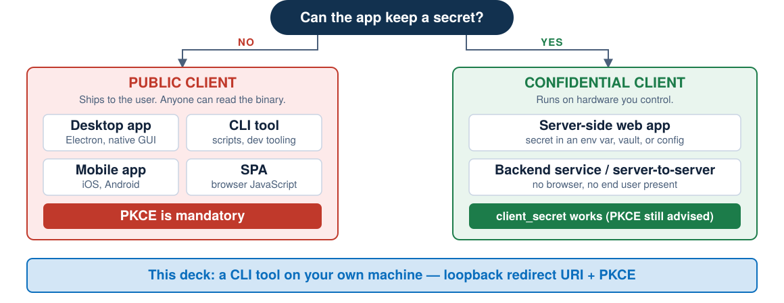
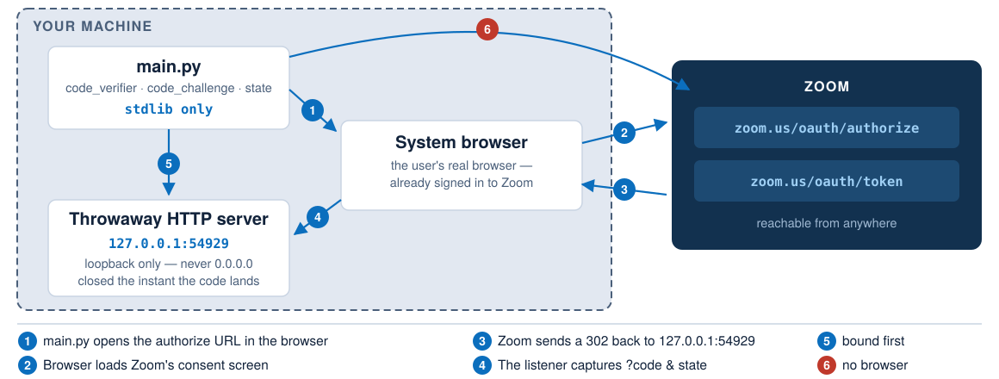
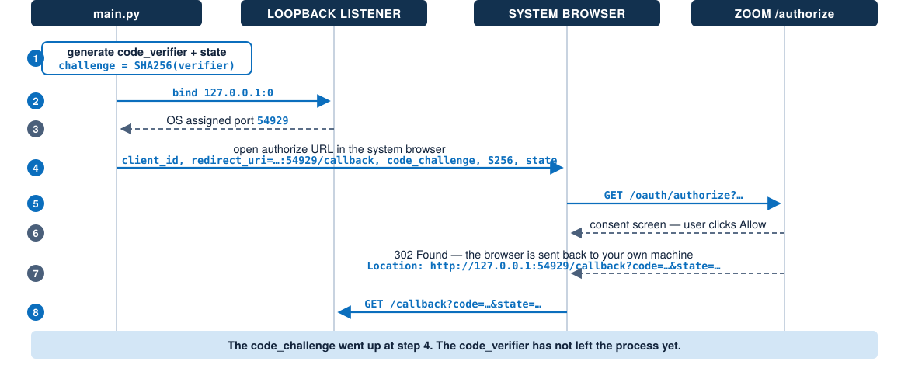
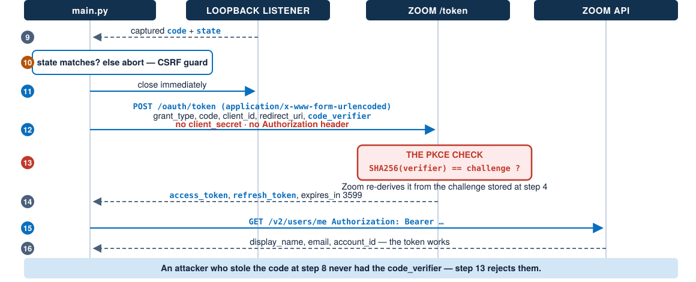

<!-- _class: title -->
<!-- _paginate: false -->
<!-- _footer: '' -->

# How to Use **PKCE** OAuth

OAuth 2.0 Authorization Code + PKCE, in Python

A CLI tool, a loopback listener, and no client secret

---

# What We Will Do

<div class="grow">

| # | Part | What you get |
|---|---|---|
| 1 | **The use case** | Which apps need PKCE, and why yours might |
| 2 | **The sequence** | All 16 steps, end to end, twice |
| 3 | **The code** | `main.py` — standard library only |
| 4 | **The demo** | Run it, read the log, then break it |

</div>

<div class="takeaway">

By the end you will have run a full OAuth flow against Zoom from your own terminal.

</div>

---

<!-- _class: lead -->

# Part 1 — The Use Case

Who actually needs PKCE?

---

# One Question Decides Everything

<div class="diagram">
  
</div>

---

# Public Client: No Secret Exists

<div class="grow">

| | Confidential | Public |
|---|---|---|
| **Runs on** | Your server | The user's machine |
| **Secret?** | Yes — env var, vault | **None** |
| **Why** | You control the host | The binary ships to the user |
| **Auth at `/token`** | `client_secret` | `code_verifier` |

</div>

<div class="takeaway">

A public client has no secret. That is deployment reality, not a misconfiguration.

</div>

---

# So What Proves It Is Your App?

<div class="grow">

<div class="cols">
<div class="card">

#### The problem

A stolen authorization `code` plus a public `client_id` is enough to get a token.

Nothing else is required.

</div>
<div class="card">

#### PKCE, RFC 7636

The app invents a **secret per request** instead of shipping one.

Sent as a hash first, in the clear only at redemption.

</div>
</div>

```text
code_verifier   43–128 random chars        kept in memory
code_challenge  BASE64URL(SHA256(verifier))  sent on /authorize
```


</div>
<div class="takeaway">

Challenge goes up with the request. Verifier goes up with the redemption.

</div>

---

# Why the Redirect Goes to Your Own Machine

<div class="diagram">
  
</div>

---

<!-- _class: lead -->

# Part 2 — The Sequence

16 steps. Two halves.

---

<!-- _class: tight -->

# Half One: Getting the Code

<div class="diagram">
  
</div>

---

<!-- _class: tight -->

# Half Two: Redeeming the Code

<div class="diagram">
  
</div>

---

# Two Rules That Cost People Hours

<div class="grow">

<div class="cols">
<div class="card">

#### 1. `127.0.0.1`, never `localhost`

`localhost` is a *name* — it resolves, and it can resolve to IPv6.

RFC 8252 §8.3 says use the IP literal.

Zoom **rejects** `localhost`.

`127.0.0.1` and `::1` are **different hosts**.

</div>
<div class="card">

#### 2. Bind first, then browse

Bind to port `0` → read the port the OS gave you → *then* build the redirect URI.

Picking a free port, closing it, and re-binding later is a race.

</div>
</div>

</div>

<div class="takeaway warn">

The redirect URI cannot exist until the socket does.

</div>

---

# `state` Is Not PKCE

<div class="grow">

| | `state` | PKCE |
|---|---|---|
| **Stops** | CSRF | Code interception |
| **Attack** | Their code in your session | Your code in their hands |
| **Checked by** | Your app | The authorization server |

</div>

<div class="takeaway danger">

They solve different problems. Use both, every time.

</div>

---

<!-- _class: lead -->

# Part 3 — The Code

`main.py` · Python 3.9+ · standard library only

---

# No Dependencies. None.

<div class="grow">

```python
import argparse, base64, hashlib, json, os, secrets
import socket, sys, time, urllib.parse, urllib.request, webbrowser
from http.server import BaseHTTPRequestHandler, HTTPServer
```

<div class="cols">
<div class="card">

#### What we get for free

`secrets` — CSPRNG
`hashlib` — SHA-256
`http.server` — the listener
`urllib` — the HTTP calls

</div>
<div class="card">

#### Why it matters

No `pip install`, no venv, no lockfile.

Clone and run. Nothing between you and the protocol.

</div>
</div>

</div>

---

<!-- _class: tight -->

# Step 1 — Generate the Verifier

<div class="grow">

```python
def generate_pkce() -> tuple[str, str]:
    verifier = base64.urlsafe_b64encode(secrets.token_bytes(32)).decode().rstrip("=")
    digest = hashlib.sha256(verifier.encode("ascii")).digest()
    challenge = base64.urlsafe_b64encode(digest).decode().rstrip("=")
    return verifier, challenge

def generate_state() -> str:
    return base64.urlsafe_b64encode(secrets.token_bytes(16)).decode().rstrip("=")
```

<div class="cols">
<div class="card">

`secrets`, not `random` — one is a CSPRNG, the other is not.

</div>
<div class="card">

`rstrip("=")` — base64url here is **unpadded**. Padding breaks the match.

</div>
</div>

</div>

---

<!-- _class: tight -->

# Step 2 — Bind First, Derive Second

<div class="grow">

```python
def start_listener(host: str, path: str, port: int):
    server = _LoopbackServer((host, port), _CallbackHandler,
                             ipv6=":" in host, expected_path=path)

    actual_port = server.server_address[1]        # what the OS actually gave us
    host_for_uri = f"[{host}]" if ":" in host else host
    redirect_uri = f"http://{host_for_uri}:{actual_port}{path}"

    return server, redirect_uri
```

</div>

<div class="takeaway">

`port=0` means "OS, pick one". We only learn the number *after* binding.

</div>

---

<!-- _class: tight -->

# Step 3 — Catch Exactly One Request

<div class="grow">

```python
class _CallbackHandler(BaseHTTPRequestHandler):
    def do_GET(self) -> None:
        parsed = urllib.parse.urlparse(self.path)

        if parsed.path != self.server.expected_path:
            self.send_response(404); self.end_headers()
            self.wfile.write(b"Not found")
            return

        params = {k: v[0] for k, v in urllib.parse.parse_qs(parsed.query).items()}
        self._respond(200, "<h1>Authorization received</h1>")
        self.server.result = params
```

</div>

<div class="takeaway warn">

The 404 branch is not defensive padding — browsers really do ask for `/favicon.ico`.

</div>

---

<!-- _class: tight -->

# Step 4 — Build the Authorize URL

<div class="grow">

```python
query = urllib.parse.urlencode({
    "response_type": "code",
    "client_id": client_id,
    "redirect_uri": redirect_uri,        # http://127.0.0.1:54929/callback
    "code_challenge": challenge,         # the hash, not the verifier
    "code_challenge_method": "S256",     # never "plain"
    "state": state,
})
return f"{authorize_base}?{query}"
```

<div class="cols">
<div class="card">

#### Note the absence

No `scope`. Zoom uses the app's build-flow scopes.

</div>
<div class="card">

#### `urlencode` matters

`redirect_uri` contains `:` and `/`. Hand-built strings break here.

</div>
</div>

</div>

---

<!-- _class: tight -->

# Step 5 — Validate, Then Redeem

<div class="grow">

```python
if params.get("state") != state:
    raise SystemExit("State mismatch — possible CSRF. Aborting.")
```

```python
fields = {
    "grant_type": "authorization_code",
    "code": code,
    "client_id": client_id,
    "redirect_uri": redirect_uri,     # must equal the one from step 4
    "code_verifier": verifier,        # the secret, revealed only now
}
data = urllib.parse.urlencode(fields).encode("ascii")
request = urllib.request.Request(token_url, data=data, method="POST",
    headers={"Content-Type": "application/x-www-form-urlencoded"})
```

</div>

<div class="takeaway danger">

No `client_secret`. No `Authorization` header. That is the whole point.

</div>

---

<!-- _class: tight -->

# Step 6 — Prove the Token Works

<div class="grow">

```python
endpoint = f"{api_base}/v2/users/me"
request = urllib.request.Request(
    endpoint, headers={"Authorization": f"Bearer {access_token}"}
)
with urllib.request.urlopen(request, timeout=30) as response:
    me = json.loads(response.read())
```

```python
except urllib.error.HTTPError as err:
    # The body is where Zoom explains itself — print it, always.
    log("error", f"HTTP {err.code}", err.read().decode("utf-8", "replace"))
```

</div>

<div class="takeaway">

Swallowing the error body is the difference between five minutes and an afternoon.

</div>

---

<!-- _class: lead -->

# Part 4 — The Demo

Register, run, read, break

---

# Marketplace Setup — Four Things

<div class="grow">

| | Where | Value |
|---|---|---|
| **1** | Create app | **General app** |
| **2** | App Credentials | **Use Public Client OAuth** → ON |
| **3** | OAuth Allow List | `http://127.0.0.1/callback` |
| **4** | Scopes | `user:read:user` |

</div>

<div class="takeaway warn">

Copy the **Public Client ID**, not the Client ID. They are different fields.

</div>

---

<!-- _class: demo -->

# Run It

<div class="grow">

```bash
git clone https://github.com/bitzed/oauth-loopback-redirect-url-python
cd oauth-loopback-redirect-url-python

python3 main.py --client-id YOUR_PUBLIC_CLIENT_ID
```

</div>

<div class="takeaway">

No install step. That is not a simplification for the slide — there is no install step.

</div>

---

<!-- _class: demo tight -->

# Watch the Whole Flow

<div class="grow">

```text
Generated PKCE + state
          { "code_challenge_method": "S256", "code_verifier_len": 43, … }
Loopback listener bound to 127.0.0.1:54929 (ephemeral port)
          { "redirect_uri": "http://127.0.0.1:54929/callback" }
Authorize URL
          https://zoom.us/oauth/authorize?response_type=code&…
Loopback received request: GET /callback?code=…&state=…
Loopback listener closed
State parameter validated
POST https://zoom.us/oauth/token
Token endpoint responded
          { "token_type": "bearer", "expires_in": 3599,
            "access_token": "eyJzdi…(1089 chars)" }
Fetched /users/me
          { "display_name": "…", "email": "…", "account_id": "…" }
──────── Flow complete 🎉 ────────
```

</div>

---

<!-- _class: demo -->

# Three Things to Notice

<div class="grow">

<div class="cols">
<div class="card">

#### The port is different every run

`54929`, then `54931`. Nothing is cached.

</div>
<div class="card">

#### The listener closes before the token call

Exposure window: milliseconds.

</div>
</div>

```text
"access_token": "eyJzdi…(1089 chars)"
```

</div>

<div class="takeaway">

Tokens are logged as shape, never as value. Build that in from line one.

</div>

---

# Now Break It On Purpose

<div class="grow">

| Change | What you get | Why |
|---|---|---|
| `--host localhost` | blocked before any request | the guard in `main()` |
| Wrong `--path` | `4709 redirect uri mismatch` | path is matched exactly |
| Wrong client id | `invalid_client` | from `/oauth/token` |
| `--port 3000`, unregistered | `Invalid redirect … (4700)` | port is part of the match |

</div>

<div class="takeaway">

Every one of these is a slide in someone's future debugging session. Cause them now.

</div>

---

# The Ephemeral Port Caveat

<div class="grow">

<div class="cols narrow-left">
<div class="card">

#### The tension

RFC 8252 wants a **fresh OS-assigned port** every run.

You cannot register a port you do not know yet.

</div>
<div class="card">

#### So the provider must ignore the port when matching

Support for this **varies between providers** — verify it against yours before you design around it.

`--port 3000` pins the listener so you can test the exact-match path as a fallback.

</div>
</div>

</div>

<div class="takeaway warn">

Test this yourself on day one. It decides your whole registration strategy.

</div>

---

# Checklist to Take Home

<div class="grow">

<div class="cols">
<div class="card">

#### Protocol

PKCE with `S256`, always
Validate `state`, every time
`127.0.0.1`, never `localhost`
Bind before you build the URI

</div>
<div class="card">

#### Runtime

Loopback only, never `0.0.0.0`
Close the listener immediately
Fresh port per attempt
Never log a token

</div>
</div>

</div>

<div class="takeaway">

`github.com/bitzed/oauth-loopback-redirect-url-python` — clone it and run it today.

</div>

---

<!-- _class: title -->
<!-- _footer: '' -->

# Thank You

**RFC 7636** PKCE · **RFC 8252** OAuth for Native Apps

developers.zoom.us/docs/integrations/oauth

github.com/bitzed/oauth-loopback-redirect-url-python
